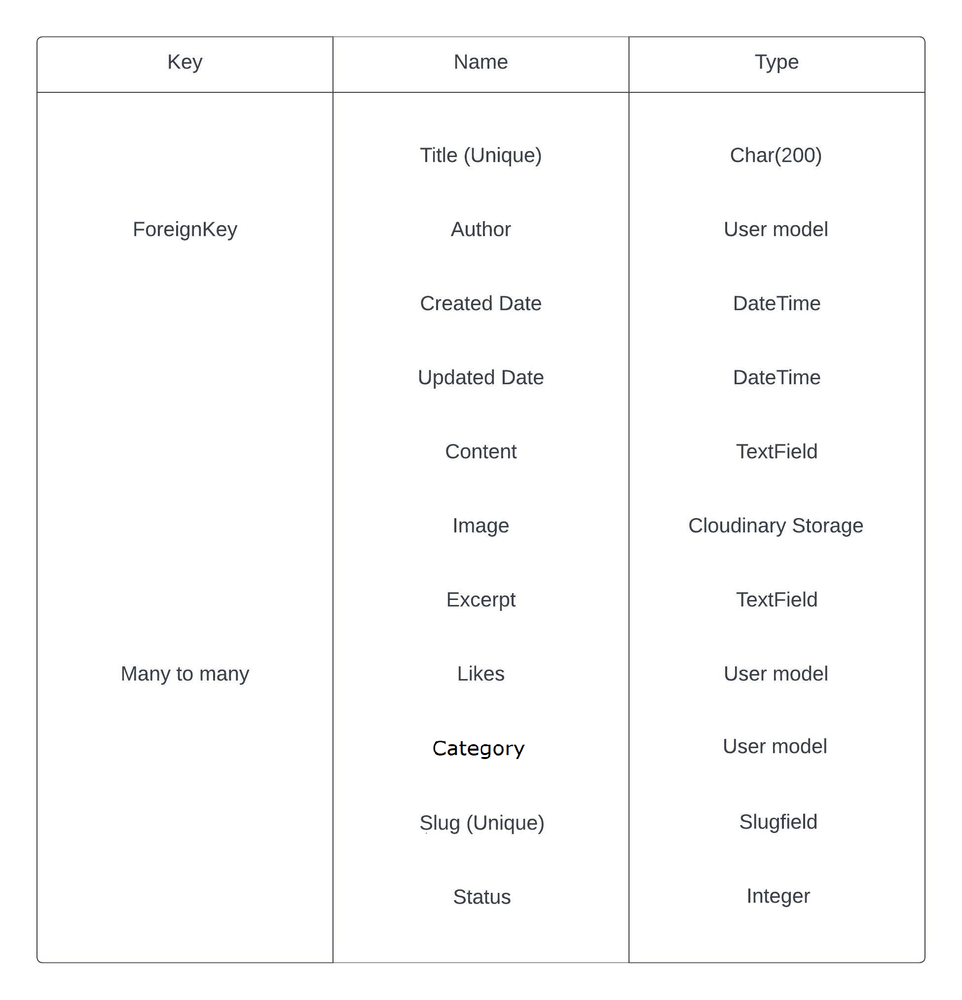
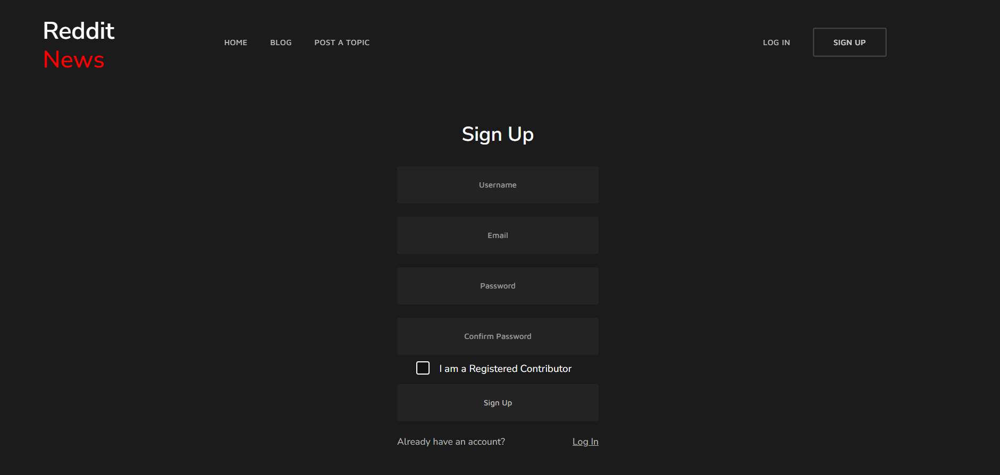
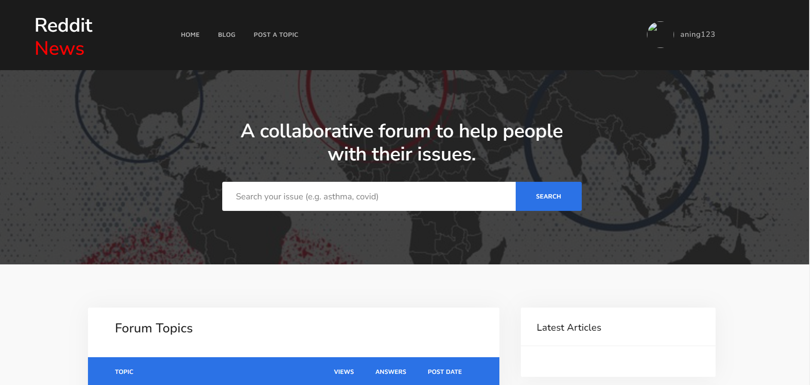
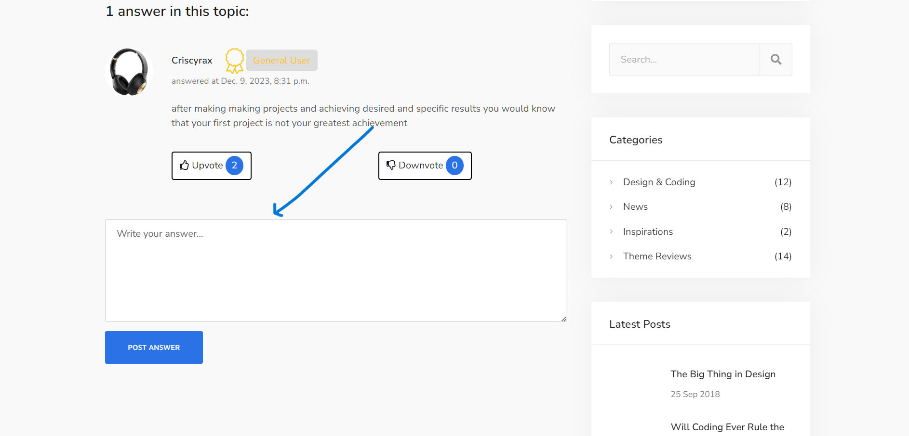
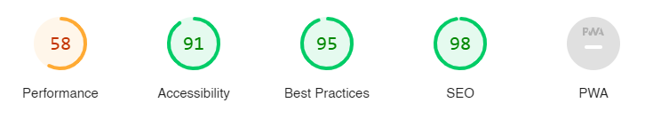

# Reddit News Blog


Portfolio 4 project as part of the Diploma in Full Stack Software Development by Code Institute.
___

A web application that allows users to view and interact with news content in a Reddit-like format. Built with Python, HTML, CSS, and Django.

It is a fullstack blog site that allows users to read blog posts, create an account and comment on the posts.

<!-- Link to live site - [https://md82p4blog.herokuapp.com/](https://md82p4blog.herokuapp.com/) -->

## CONTENTS

- [Reddit News Blog](#reddit-news-blog)
  - [CONTENTS](#contents)
  - [Site Objectives](#site-objectives)
- [User Experience/UX](#user-experienceux)
  - [Target Audience](#target-audience)
  - [User Stories](#user-stories)
    - [New Visitor Goals](#new-visitor-goals)
    - [Existing Visitor Goals](#existing-visitor-goals)
- [Design Choices](#design-choices)
  - [Colour Scheme](#colour-scheme)
  - [Typography](#typography)
  - [Logo and Favicon](#logo-and-favicon)
  - [Wireframes](#wireframes)
  - [Flow Diagram](#flow-diagram)
  - [Database Plan](#database-plan)
- [Features](#features)
  - [Registration](#registration)
  - [Future Features](#future-features)
  - [Features Not Included](#features-not-included)
- [Technologies Used](#technologies-used)
- [Programming Languages, Frameworks and Libraries Used](#programming-languages-frameworks-and-libraries-used)
- [Agile](#agile)
- [Testing](#testing)
  - [Manual Testing](#manual-testing)
  - [User](#user)
  - [Bugs](#bugs)
  - [Lighthouse](#lighthouse)
  - [Validation Testing](#validation-testing)
    - [HTML \& CSS](#html--css)
  - [Python Testing](#python-testing)
  - [Deployment](#deployment)
    - [Github Deployment](#github-deployment)
    - [Creating a Fork or Copying](#creating-a-fork-or-copying)
    - [Clone](#clone)
    - [Repository deployment via Heroku](#repository-deployment-via-heroku)
    - [Deployment of the app](#deployment-of-the-app)
  - [Credits](#credits)
  - [Media](#media)
  - [Acknowledgments and Thanks](#acknowledgments-and-thanks)

___

## Site Objectives

Design and create a blog site to demonstrate an increasing understanding of the libraries and frameworks available to developers.

My  objectives were:

## 1. Discover Relevant and Engaging Content

**Objective:** Users should be able to easily discover news articles and discussions that align with their interests. The app employs a user-friendly interface and robust search functionalities to enhance content discoverability.

## 2. Participate in Community Discussions

**Objective:** Foster an environment where users feel encouraged to actively participate in discussions. The commenting system, upvoting, and downvoting features are geared towards facilitating meaningful interactions and diverse perspectives.

## 3. Customize and Personalize User Experience

**Objective:** Allow users to personalize their experience by creating accounts, setting preferences, and subscribing to specific subreddits. Personalization enhances user engagement and tailors the content to individual interests.

## 4. Explore Niche Interests through Subreddits

**Objective:** Provide a diverse range of subreddits covering various topics and interests. Users can explore and contribute to niche communities, creating a platform that caters to a broad spectrum of preferences.

## 5. Stay Updated with Breaking News

**Objective:** Keep users informed about the latest news and trending topics. The app features a curated front page, highlighting popular and breaking stories to ensure users stay up-to-date with current events.

## 6. Seamless Cross-Device Experience

**Objective:** Offer a seamless and responsive design that adapts to different devices and screen sizes. Users can enjoy the Reddit News Web App on desktops, tablets, and mobile devices without compromising usability.

## 7. Contribute to Content Curation

**Objective:** Empower users to contribute positively to the community by submitting quality content, engaging in discussions, and adhering to community guidelines. The app aims to create a collaborative and respectful space.

By focusing on these user goals, the Reddit News Web App aims to provide an inclusive, informative, and enjoyable platform for individuals seeking a diverse and engaging online community.

<!-- - ### Store data on an external cloud database

  I used ElephantSQL to store the PostgreSQL database for this project. -->

___

# User Experience/UX

## Target Audience

- Users interested in seeking interactive discussions who are familiar with platforms like Reddit, also users desiring customizable news feeds, journalists and content creators 

## User Stories

### New Visitor Goals

- To understand what the site and content is about.
- How to navigate the site.
- Create an account and engage with the site and other users and site owner.

### Existing Visitor Goals

- Log in and out of their account.
- Read blog posts and comments on each post.
- Add their own comments on blog posts on the site to engage with site owner and other users.

___

# Design Choices

## Colour Scheme

The colour scheme used for this project was based on the colors from Code Institute's 'I think therefore I blog' walkthrough module. I have added and modified many aspects of the styling and colours to suit my intentions. It is a fairly neutral scheme, with only the actionable aspects (buttons/links etc) displayed in brighter colours for ease of navigation or site use.

## Typography

The main font used is Nunito Sans, but MavenPro was used for the texts on the header

## Logo and Favicon

The Logo is just a simple text using MavenPro as the font

## Wireframes

- Mobile Homepage Wireframe


- Mobile Post Detail Wireframe


- Desktop Homepage Wireframe


- Desktop Post Detail Wireframe


## Flow Diagram

Here is a diagram showing the possible flow through the site. There are 2 sections shown here. On the left it shows the Admin and the right shows a site user.


## Database Plan

The database plan is fairly simple, but it shows the information that is stored within the database, the type of data and if it is logged as a Primary or Foreign key where applicable.



# Features

## Registration

The user can Sign up




## View Blog Posts on Home Page



## Browse by Post Category


## Comment on Blog Posts.

*Also shown here is the trashcan which allows users to upvote or downvote*




## Subreddit Selection
Users can choose their favorite subreddits to customize their news feed. The application supports a wide range of subreddits, allowing users to stay informed about topics that interest them the most.

## News Feed

The heart of the application, the news feed displays the latest and most popular posts from the selected subreddits. Users can scroll through posts, view Images, and read article previews without leaving the application.


## Search Functionality

A powerful search feature enables users to find specific posts, subreddits, or user profiles. The search functionality includes auto-suggestions, making it easy for users to discover content relevant to their interests.

## Responsive Design

The Reddit News Web App is built with a responsive design, ensuring optimal user experience across various devices, including desktops, tablets, and smartphones.

## Trending Topics

Stay informed about trending topics with the application's trending section. This feature highlights the most discussed and popular posts across all selected subreddits.

## Dark Mode

Enhance user experience with a dark mode option. Users can toggle between light and dark modes based on their preferences, reducing eye strain during nighttime browsing.

## User Profile

Each user has a customizable profile where they can view their posts, comments, and upvoted content. The profile section provides a summary of the user's activity within the application.

## Notifications

Receive real-time notifications for upvoted posts, new comments on user-generated content, and other relevant updates. The notification system keeps users engaged and informed.

## Moderation Tools

For subreddit moderators, the application offers moderation tools to manage and monitor user-generated content. This includes the ability to remove posts, ban users, and enforce subreddit rules.

## External Links Handling

The application gracefully handles external links, allowing users to open articles, Images, or websites associated with posts directly within the app.


## Future Features

- Add an option for users to edit comments
- Add profile page for users to add profile image and edit personal details

## Features Not Included

- Add an option for users to upload photos into the comments

___

# Technologies Used

These are the technologies used in building this project:

- [Github](https://github.com) To host and store the data for the site.
- [CodeAnywhere](https://codeanywhere.com/) To create and build this project
- [CodeAnywhere](https://www.codeanywhere.com) the IDE where the site was built.
- [PEP8 Validator](https://pep8ci.herokuapp.com/) Used to check python code for errors
- [ElephandSQL](https://www.elephantsql.com/) Used to store PostgreSQL database.
- [Cloudinary](https://cloudinary.com/) Used as cloud storage for Images uploaded as part of the blog posts
- [Heroku](https://id.heroku.com/) Used to deploy the project

# Programming Languages, Frameworks and Libraries Used

- [HTML](https://developer.mozilla.org/en-US/docs/Web/HTML)
- [CSS](https://developer.mozilla.org/en-US/docs/Learn/Getting_started_with_the_web/CSS_basics)
- [Python](https://en.wikipedia.org/wiki/Python_(programming_language))
- [Django](https://www.djangoproject.com/)
- [Bootstrap](https://getbootstrap.com/)

# Agile

This project was designed using Agile methodology, utilising the Project Board and Issues sections in GitHub

<!-- - [Project Board](https://github.com/users/markdaniel1982/projects/4/views/1) -->

# Testing

As each section or Function/Model was built during this project, I was testing for functionality and styling issues that may have arisen (see table below), which were corrected or fixed before continuing. I also had friends test the site by signing up, adding and deleting comments using various devices on varying platforms (IOS, Android, Mobile, Tablet etc) and reporting back any issues they encountered with functionality or styling.

## Manual Testing

## User

| TEST | OUTCOME | PASS/FAIL|
|:---:|:---:|:---:|
| Create Account | Created successfully | Pass |
| Login | Login Successful | Pass |
| Logout | Logout Successful | Pass |
| Read Full Blog Post | PostDetail page loaded successfully | Pass |
| Add Comment under Blogpost | Comment Added Successfully | Pass |
| Upvote Comment | Comment Upvoted | Pass |
| Downvote Comment | Comment Downvoted | Pass |
| Filter Posts by category | Posts marked as selected category displayed successfully | Pass |


(*) See Bugs below

## Bugs


At different points throughout this project, I encountered various bugs involving the styling. These usually appeared after adding a new section or template page. These were all fixed using Bootstrap classes or custom CSS to override any issues caused by Bootstrap itself.

Towards the end of completion, I had an issue with the database, where I had made a change to the Post Model, but hadn't migrated the changes after undoing the changes in the code relating to that change. This required me to reset the database, which was done with help from Rebecca via the Code Institute's Tutor Support. The changes related to the Category Model and the choices available when creating an account.

To enable me to reset the database, I first had to comment out the code (related to "choices" in the model) to stop the code being run and causing an error. Once this was done, the database was reset, seemingly without issue.

Then I had a problem with the "Create a Post" page. When adding a new blog post via the browser, the Images were not being sent to cloudinary for cloud storage, and the ElephantSQL cloud database was also not recieving any data. This was a very simple fix as I needed to add ```enctype="multipart/form-data"``` into the form element.

## Lighthouse

Using Lighthouse these were the scores obtained

Mobile


Desktop



## Validation Testing

### HTML & CSS

HTML & CSS testing was done using [W3 Validator](https://validator.w3.org/)

When validating the code, There were no errors found as shown below


## Python Testing

Python pep8 validation was done via [Code Institute's Python Linter](https://pep8ci.herokuapp.com/)

The only errors recieved here were where some lines of text exceeded the limit of 79 characters, but these have now been rectified.

Python Files Tested:

- models
- forms
- views
- urls

___

## Deployment

### Github Deployment

The website was stored using GitHub for storage of data and version control. To do this I did the following;

After each addition, change or removal of code, in the terminal within your IDE (I used codeanywhere for this project) type:

- git add .
- git commit -m "meaningful commit message"
- git push

The files are now available to view within your github repository.

### Creating a Fork or Copying

To clone/fork/copy the repository you click on the fork tab which is situated next to unwatch tab in the top right corner of the page

### Clone

To create a clone you do the following;

1. Click on the code tab, left of the Gitpod tab
2. To the right of the repository name, click the clipboard icon
3. In the IED open GitBash
4. Change the working directory to the location you prefer
5. Add Git Clone with the copy of the repository name
6. Clone has been created

### Repository deployment via Heroku

- On the [Heroku Dashboard](https://dashboard.heroku.com) page, click New and then select Create New App from the drop-down menu.
- When the next page loads insert the App name and Choose a region. Then click 'Create app'
- In the settings tab click on Reveal Config Vars and add the key Port and the value 8000. The credentials for this app were:

1. Cloudinary URL
2. Postgres Database URL
3. Port (8000)

- Below this click Add buildpack and choose python and nodejs in that order.

### Deployment of the app

- Click on the Deploy tab and select Github-Connect to Github.
- Enter the repository name and click Search.
- Choose the repository that holds the correct files and click Connect.
- A choice is offered between manual or automatic deployment whereby the app is updated when changes are pushed to GitHub.
- Once the deployment method has been chosen the app will be built and can be launched by clicking the Open app button which should appear below the build information window, alternatively, there is another button located in the top right of the page.

___

## Credits

This project was based on the Code Institute's - I think therefore I blog walkthrough module which provided a standard blog 'base'. From this base I customised a lot of the layout and styling with Bootstrap and custom CSS. I also added a custom model for Category. This allowed me to create a functionality within the site for users to filter the blog posts by a selected category.

I also added several custom Views and Forms to the site, as well as ensuring that all links and desired functionality was working as intended with no errors.

For inspiration and fine-tuning of my code, I referred to John Elder's youtube channel [Codemy](https://www.youtube.com/@Codemycom) where I was able to get a better understanding of how to correctly create this type of product using Django and Bootstrap.

The Readme layout was based on the example by [Kera Cudmore - Readme Examples](https://github.com/kera-cudmore/readme-examples/blob/main/README.md?plain=1) and [Sdalsosa - Readme](https://github.com/Sdalsosa/ComposerHub/blob/main/README.md)

The wireframe mockups were created using [Figma](https://https://www.figma.com/)

Once complete, the readme file was passed through a spelling and grammar check via [Grammarly](https://www.grammarly.com/)

___

## Media

For placeholder Images when no image is uploaded to blog post, I have used [picsum](https://picsum.photos/) which provides a library of stock Images that display as a placeholder.

All other content and Images are my own.

___

## Acknowledgments and Thanks

Sean & Oisin at Code Institute's tutor support for the help and guidance with my code-related brain melts.

Rebecca at Code Institute's tutor support for the database reset guidance.

John Elder on the [Codemy](https://www.youtube.com/@Codemycom) youtube channel

For help with manual testing:

- Liz Mayhew
- Tom Mayhew
- Nush
- Marie Daniel
- Hannah Cook
- Thomas Spåre
- Shubham Sinha
